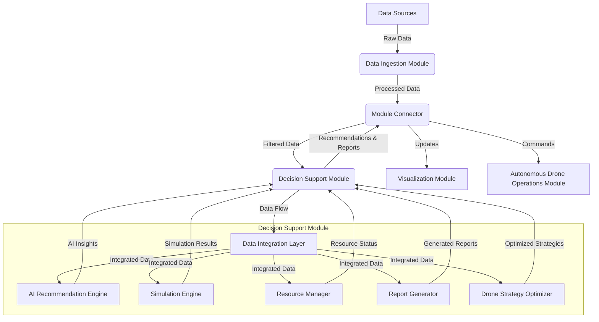

 Decision Support Module Technical Plan

## 1. Module Overview

The Decision Support Module is a critical component of the Wildfire Common Operating Picture (CoP) System, responsible for assisting in strategic decision-making during wildfire management operations. It leverages AI and data analytics to provide recommendations, run simulations, manage resources, generate reports, and optimize drone deployment strategies.

## 2. Detailed Functionality

### 2.1 AI-Assisted Recommendations
- Analyze real-time data from various sources (weather, fire behavior, resources)
- Use machine learning models to predict fire spread and behavior
- Generate actionable recommendations for fire suppression tactics
- Provide risk assessments for different strategies

### 2.2 Scenario Simulations
- Develop a simulation engine for running "what-if" scenarios
- Model fire behavior under different weather conditions and suppression tactics
- Simulate resource allocation strategies and their potential outcomes
- Provide visual and numerical outputs for easy interpretation

### 2.3 Resource Management and Tracking
- Maintain a real-time inventory of available resources (personnel, equipment, aircraft)
- Track resource locations and status
- Optimize resource allocation based on current needs and predictions
- Generate alerts for resource shortages or redeployment needs

### 2.4 Automated Report Generation
- Compile data from various modules into comprehensive reports
- Generate periodic situation reports (SitReps) automatically
- Produce customized reports for different stakeholders (incident commanders, public information officers, etc.)
- Create visualizations and summaries of key metrics and trends

### 2.5 Drone Deployment Optimization
- Analyze terrain, weather conditions, and fire behavior to determine optimal drone flight paths
- Coordinate with the Autonomous Drone Operations Module for mission planning
- Prioritize areas for drone surveillance based on fire risk and information needs
- Optimize drone battery life and data collection efficiency

## 3. Technical Architecture and Information Flow



## 4. Project Structure

```
decision_support_module/
│
├── src/
│   ├── ai_engine/
│   │   ├── __init__.py
│   │   ├── recommendation_model.py
│   │   ├── fire_prediction.py
│   │   └── risk_assessment.py
│   │
│   ├── simulation/
│   │   ├── __init__.py
│   │   ├── simulation_engine.py
│   │   ├── fire_behavior_model.py
│   │   └── resource_allocation_sim.py
│   │
│   ├── resource_management/
│   │   ├── __init__.py
│   │   ├── resource_tracker.py
│   │   ├── inventory_manager.py
│   │   └── allocation_optimizer.py
│   │
│   ├── reporting/
│   │   ├── __init__.py
│   │   ├── report_generator.py
│   │   ├── visualization_utils.py
│   │   └── template_manager.py
│   │
│   ├── drone_optimization/
│   │   ├── __init__.py
│   │   ├── path_planner.py
│   │   ├── mission_optimizer.py
│   │   └── battery_manager.py
│   │
│   └── data_integration/
│       ├── __init__.py
│       ├── data_adapter.py
│       ├── data_preprocessor.py
│       └── data_validator.py
│
├── tests/
│   ├── test_ai_engine.py
│   ├── test_simulation.py
│   ├── test_resource_management.py
│   ├── test_reporting.py
│   ├── test_drone_optimization.py
│   └── test_data_integration.py
│
├── config/
│   ├── ai_models_config.yaml
│   ├── simulation_params.yaml
│   ├── resource_types.yaml
│   └── report_templates/
│       ├── sitrep_template.md
│       └── executive_summary_template.md
│
├── docs/
│   ├── api_reference.md
│   ├── user_guide.md
│   └── developer_guide.md
│
├── requirements.txt
├── setup.py
└── README.md
```

## 5. Key Components and Technologies

### 5.1 AI Recommendation Engine
- Language: Python
- Key Libraries: TensorFlow or PyTorch, Scikit-learn, NumPy
- Functionality: Implements machine learning models for fire prediction and strategic recommendations

### 5.2 Simulation Engine
- Language: Python with C++ extensions for performance-critical parts
- Key Libraries: SimPy for discrete event simulation, NumPy for numerical computations
- Functionality: Runs scenario simulations and fire behavior models

### 5.3 Resource Management System
- Language: Python
- Key Libraries: SQLAlchemy for database interactions, Pandas for data manipulation
- Functionality: Tracks and manages resources, optimizes allocations

### 5.4 Report Generator
- Language: Python
- Key Libraries: Jinja2 for templating, Matplotlib and Seaborn for visualizations
- Functionality: Generates automated reports and visualizations

### 5.5 Drone Optimization System
- Language: Python
- Key Libraries: NetworkX for graph algorithms, SciPy for optimization
- Functionality: Plans optimal drone paths and missions

### 5.6 Data Integration Layer
- Language: Python
- Key Libraries: Apache Kafka for real-time data streaming, Pandas for data manipulation
- Functionality: Integrates data from various sources and prepares it for use by other components

## 6. Development and Deployment Considerations

1. Use a modular architecture to allow for easy updates and maintenance of individual components.
2. Implement comprehensive unit and integration testing for all components.
3. Use configuration files (YAML) to manage parameters and settings for easy adjustment.
4. Implement logging throughout the module for debugging and auditing purposes.
5. Use containerization (Docker) for consistent development and deployment environments.
6. Implement API versioning to ensure backward compatibility as the module evolves.
7. Use asynchronous programming techniques for improved performance in data processing and simulations.

This technical plan provides a comprehensive overview of the Decision Support Module, including its functionality, architecture, and project structure. It leverages Python for most components, with C++ extensions for performance-critical simulations. The modular design allows for flexibility and scalability as the system grows and evolves.