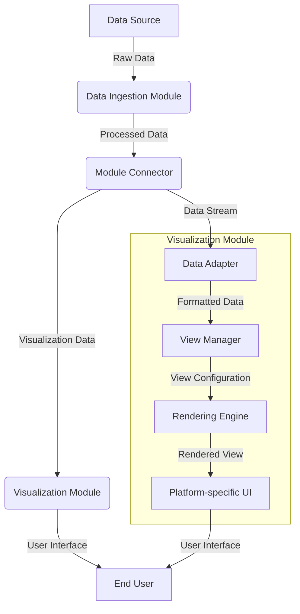

# Visualization Module Technical Plan

## 1. Module Overview

The Visualization Module is responsible for presenting data from the Wildfire Common Operating Picture (CoP) System in user-friendly interfaces. It renders interactive geospatial dashboards, provides AR interfaces for field operations, generates customized views for different user roles, ensures multi-platform compatibility, and displays real-time drone footage with data overlays.

## 2. Detailed Functionality

### 2.1 Geospatial Dashboard Rendering
- Implement a map-based interface using OpenLayers or Mapbox GL
- Render fire perimeters, hotspots, and resource locations
- Provide layer controls for toggling different data overlays
- Implement zoom and pan functionality
- Display real-time weather data and fire behavior predictions

### 2.2 AR Interface for Field Operations
- Develop mobile AR application using ARCore (Android) and ARKit (iOS)
- Overlay fire information, resource locations, and navigation data on camera feed
- Implement gesture controls for interacting with AR elements
- Provide voice commands for hands-free operation

### 2.3 Customized Views Generation
- Create role-based dashboards (e.g., Incident Commander, Operations Chief, Public Information Officer)
- Implement a view designer tool for custom dashboard creation
- Develop a template system for quick view switching

### 2.4 Multi-platform Compatibility
- Implement responsive web design for desktop and mobile browsers
- Develop native mobile applications for iOS and Android
- Create desktop applications for Windows, macOS, and Linux

### 2.5 Real-time Drone Footage Display
- Implement video streaming capabilities using WebRTC
- Develop a video player with DVR-like controls (pause, rewind, fast-forward)
- Create an overlay system for displaying sensor data on top of video feeds
- Implement multi-view capability for displaying multiple drone feeds simultaneously

### 2.6 Data Visualization Components
- Develop a charting library for various data representations (line charts, bar charts, heatmaps)
- Implement a 3D terrain visualization system
- Create animated visualizations for time-series data (e.g., fire spread over time)

## 3. Architecture and Information Flow



## 4. Component Breakdown and Language Selection

### 4.1 C++ Components (Performance-Critical)
1. Rendering Engine
   - OpenGL-based graphics pipeline
   - Shader management
   - Texture handling
   - Geometry processing

2. Video Processing
   - Real-time video decoding and processing
   - Frame buffering and synchronization

3. 3D Terrain Engine
   - Terrain mesh generation and optimization
   - Level-of-detail (LOD) system

4. Data Processing Pipeline
   - High-performance data transformation and filtering
   - Multithreaded data processing

### 4.2 Python Components (Rapid Development, High-Level Logic)
1. View Manager
   - Dashboard configuration and management
   - User role and permission handling

2. Data Adapter
   - Integration with Module Connector
   - Data format conversion and normalization

3. Charting Library
   - Matplotlib-based charting components
   - Custom visualization widgets

4. AR Content Generation
   - AR marker detection and tracking
   - Dynamic content positioning and scaling

5. Platform-specific UI
   - PyQt for desktop applications
   - Flask for web interface

## 5. Key Libraries and Frameworks

- C++: OpenGL, SDL2, FFmpeg, Boost, OpenCV
- Python: NumPy, Pandas, Matplotlib, PyOpenGL, Flask, PyQt

## 6. Integration Points

1. Module Connector Interface
   - Implement a ZeroMQ-based messaging system for real-time data exchange
   - Develop a REST API for configuration and management tasks

2. Data Ingestion Module
   - Create a data streaming interface using Apache Kafka
   - Implement a caching mechanism for frequently accessed data

3. Analytics Engine Module
   - Develop a subscription system for real-time analytics updates
   - Create a query interface for on-demand data retrieval

4. Decision Support Module
   - Implement a notification system for critical alerts and recommendations
   - Develop a visualization pipeline for decision trees and resource allocation plans

## 7. Performance Considerations

1. Implement multi-threaded rendering for smooth UI performance
2. Use GPU acceleration for complex visualizations and video processing
3. Optimize data structures for rapid access and minimal memory footprint
4. Implement level-of-detail (LOD) systems for large-scale data visualization
5. Use caching mechanisms to reduce data transfer and processing overhead

## 8. Security Measures

1. Implement end-to-end encryption for all data transmissions
2. Use secure WebSocket connections for real-time data streaming
3. Implement role-based access control for different visualization components
4. Sanitize all user inputs to prevent injection attacks
5. Use signed and encrypted data storage for offline mode

## 9. Testing Strategy

1. Develop a comprehensive unit test suite for all components
2. Implement integration tests for module interactions
3. Conduct performance benchmarks for rendering and data processing
4. Perform usability testing with actual end-users
5. Develop a set of stress tests to evaluate system behavior under high load

This technical plan provides a solid foundation for developing the Visualization Module, leveraging the strengths of both C++ and Python to create a high-performance, flexible, and user-friendly visualization system for the Wildfire CoP System.

# Visualization Module Project Structure

```
visualization_module/
│
├── src/
│   ├── cpp/
│   │   ├── rendering_engine/
│   │   │   ├── opengl_pipeline.cpp
│   │   │   ├── shader_manager.cpp
│   │   │   ├── texture_handler.cpp
│   │   │   └── geometry_processor.cpp
│   │   ├── video_processing/
│   │   │   ├── video_decoder.cpp
│   │   │   ├── frame_buffer.cpp
│   │   │   └── sync_manager.cpp
│   │   ├── terrain_engine/
│   │   │   ├── mesh_generator.cpp
│   │   │   ├── lod_system.cpp
│   │   │   └── terrain_optimizer.cpp
│   │   └── data_pipeline/
│   │       ├── data_transformer.cpp
│   │       ├── data_filter.cpp
│   │       └── thread_pool.cpp
│   │
│   ├── python/
│   │   ├── view_manager/
│   │   │   ├── dashboard_config.py
│   │   │   ├── user_roles.py
│   │   │   └── permission_handler.py
│   │   ├── data_adapter/
│   │   │   ├── connector_interface.py
│   │   │   ├── data_normalizer.py
│   │   │   └── cache_manager.py
│   │   ├── charting/
│   │   │   ├── matplotlib_wrapper.py
│   │   │   ├── custom_charts.py
│   │   │   └── widget_factory.py
│   │   ├── ar_content/
│   │   │   ├── marker_detector.py
│   │   │   ├── content_positioner.py
│   │   │   └── ar_overlay_generator.py
│   │   └── ui/
│   │       ├── desktop/
│   │       │   └── pyqt_interface.py
│   │       └── web/
│   │           └── flask_app.py
│   │
│   └── common/
│       ├── config.py
│       ├── utils.py
│       └── constants.py
│
├── include/
│   └── visualization_module/
│       ├── rendering_engine.h
│       ├── video_processor.h
│       ├── terrain_engine.h
│       └── data_pipeline.h
│
├── lib/
│   ├── third_party_lib1/
│   └── third_party_lib2/
│
├── tests/
│   ├── cpp/
│   │   ├── test_rendering_engine.cpp
│   │   ├── test_video_processing.cpp
│   │   ├── test_terrain_engine.cpp
│   │   └── test_data_pipeline.cpp
│   │
│   └── python/
│       ├── test_view_manager.py
│       ├── test_data_adapter.py
│       ├── test_charting.py
│       ├── test_ar_content.py
│       └── test_ui.py
│
├── docs/
│   ├── api/
│   ├── user_guide/
│   └── developer_guide/
│
├── scripts/
│   ├── build.sh
│   ├── test.sh
│   └── deploy.sh
│
├── requirements.txt
├── setup.py
├── CMakeLists.txt
└── README.md
```

## File Descriptions

### C++ Files (`.cpp` and `.h`)
- Located in `src/cpp/` and `include/visualization_module/`
- Implement performance-critical components:
  - Rendering Engine
  - Video Processing
  - 3D Terrain Engine
  - Data Processing Pipeline

### Python Files (`.py`)
- Located in `src/python/`
- Implement high-level logic and rapid development components:
  - View Manager
  - Data Adapter
  - Charting Library
  - AR Content Generation
  - Platform-specific UI (PyQt for desktop, Flask for web)

### Common Files
- `src/common/`: Shared utilities and constants used by both C++ and Python components
- `requirements.txt`: Python dependencies
- `setup.py`: Python package configuration
- `CMakeLists.txt`: CMake configuration for C++ components
- `README.md`: Project documentation

## Key Directories

1. `src/`: Contains all source code, separated into `cpp/` and `python/` subdirectories
2. `include/`: C++ header files
3. `lib/`: Third-party libraries
4. `tests/`: Unit and integration tests, mirroring the `src/` structure
5. `docs/`: Project documentation
6. `scripts/`: Build, test, and deployment scripts

This structure separates C++ and Python components while maintaining a logical organization. It allows for easy navigation, clear separation of concerns, and straightforward integration of the two languages.
